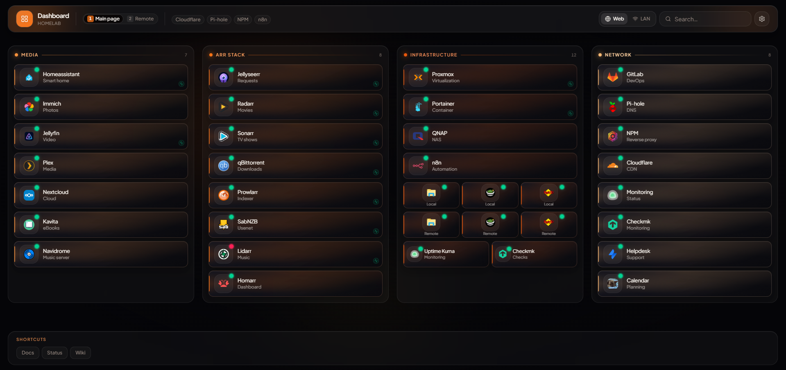

# Homelab Dashboard



Selbst gehostetes Dashboard für Homelab-Dienste: Kacheln mit Health-Checks, Live-API-Widgets, mehrere Seiten, Web/LAN-Umschaltung und vollständige Browser-Konfiguration — ohne YAML oder Config-Dateien.

**English version:** [README.md](README.md)

## Highlights

- **Dashboard** — Kategorie-Spalten, Live-Suche, Health-Status, Glass-Design mit Theme-Presets
- **Mehrere Seiten** — Tabs mit Tastaturkürzeln `1`–`9`, Kategorien pro Seite
- **Web / LAN** — pro Dienst externe und lokale URL; Umschaltung im Header
- **Hover-Widgets** — Live-Daten von 35+ Diensten (Plex, Nextcloud, Proxmox, …)
- **Layout per Strg** — angemeldete Nutzer ordnen Kategorien und Kacheln per Drag & Drop
- **Dienst-Zeilen** — bis zu drei Dienste nebeneinander pro Zeile (Admin und Dashboard)
- **Admin** — Dienste, Kategorien, Seiten, Header/Footer-Links, Themes, Backup
- **Mehrsprachigkeit** — Englisch und Deutsch; Sprachumschalter unter Admin → Einstellungen
- **Docker-ready** — SQLite-Volume, Migrationen beim Start

## Schnellstart

### Voraussetzungen

Node.js 20+ & npm  
oder  
Docker

### Lokal (Entwicklung)

```bash
cp .env.example .env
# ADMIN_PASSWORD und SESSION_SECRET in .env setzen

npm install
npm run db:migrate
npm run dev
```

| URL | Beschreibung |
|-----|--------------|
| http://localhost:3000 | Dashboard |
| http://localhost:3000/admin | Admin (Login mit `ADMIN_PASSWORD`) |

### Docker

```bash
cp .env.example .env
# PORT=3333 und Production-Secrets setzen

docker compose up -d --build
```

Dashboard: **http://localhost:3333** (oder der in `.env` gesetzte `PORT`)

Die SQLite-Datenbank liegt im Volume `./data`. Migrationen laufen beim Container-Start automatisch.

---

## Konfiguration

Alle Einstellungen erfolgen im Admin unter `/admin`. Der zuletzt geöffnete Tab wird im Browser gemerkt.

### Dienste

| Funktion | Beschreibung |
|----------|--------------|
| **Web-URL / LAN-URL** | Externe Adresse und optionale lokale IP/Hostname |
| **Aktiv / Inaktiv** | Deaktivierte Dienste werden ausgeblendet |
| **Icons** | Vorlagen aus `assets/`, eigene URL oder Upload |
| **Kachelfarbe** | Individuelle Akzentfarbe |
| **Health-Check** | Optional abweichende URL; TLS-Ausnahme pro Dienst |
| **Hover-Widget** | API-Anbindung mit verschlüsselten Zugangsdaten |
| **Link-Ziel** | Gleicher Tab oder neuer Tab |
| **Zeilen-Layout** | Bis zu drei Dienste pro Zeile nebeneinander anordnen |

Ungespeicherte Änderungen in Dienst- oder Kategorie-Dialogen lösen vor dem Schließen eine Bestätigung aus.

#### Dienste in Zeilen anordnen

Im Admin unter **Dienste** bleibt die Standardansicht eine **volle Zeile pro Dienst**. Per Drag & Drop lassen sich Dienste zusätzlich **nebeneinander** oder **dazwischen** platzieren — bis zu drei pro Zeile. Das Layout wird automatisch gespeichert und im Dashboard übernommen.

| Aktion | So geht's |
|--------|-----------|
| **Eigene Zeile** | Dienst auf die **Linie oberhalb** einer Zeile ziehen |
| **Rechts daneben** | Dienst in die **vertikale Linie** rechts neben einer Kachel ziehen |
| **Dazwischen** | Dienst in die **vertikale Linie zwischen** zwei Kacheln ziehen |
| **Neue Zeile unten** | Dienst unter die letzte Zeile der Kategorie ziehen |

Einzelne Dienste nutzen weiterhin die volle Breite — nur bewusst gruppierte Kacheln stehen nebeneinander.

#### Darstellung im Dashboard

| Anordnung | Darstellung |
|-----------|-------------|
| **1 pro Zeile** | Normale Kachel: Icon links, Name und Untertitel |
| **2 pro Zeile** | Kompakte Kacheln mit etwas Abstand, gleiche Zeilenhöhe |
| **3 pro Zeile** | Icon oben, Untertitel darunter (ohne Dienstname), gleiche Zeilenhöhe |

Im Dashboard können angemeldete Admins das Layout zusätzlich mit **Strg + Drag & Drop** anpassen (horizontale und vertikale Einfüge-Linien wie im Admin).

Die gewählte Dienste-Seite im Admin wird im Browser gemerkt.

### Seiten

Mehrere Dashboard-Seiten mit eigenen Kategorien. Im Dashboard wechseln per Tab-Leiste oder Tasten `1`–`9`.

### Design (Einstellungen)

- Theme-Presets (Ember, Stealth, Neon, Cobalt) oder eigene Farben
- Dark / Light Mode
- Hintergrundbild und Logo
- Layout-Slider: Icon-Größe, Kachelform, Schrift, Spaltenabstand, maximale Breite
- **Sprache** — Englisch oder Deutsch (Cookie, gilt für Dashboard und Admin)

### Web / LAN

| Modus | Verhalten |
|-------|-----------|
| **Web** | Nutzt immer die Web-URL |
| **LAN** | Nutzt `lanUrl`, falls gesetzt; sonst abgedunkelte Kachel mit Hinweis |

Die Auswahl bleibt nach Reload erhalten (`localStorage`).

### Layout bearbeiten (Dashboard)

1. **Strg** gedrückt halten
2. Kategorien (⋮⋮-Griff) und Kacheln per Drag & Drop anordnen
3. **Strg** loslassen — normale Navigation

Beim Verschieben von Kacheln erscheinen **Einfüge-Linien**: horizontal zwischen Zeilen, vertikal zwischen oder neben Kacheln in einer Zeile. Nur für angemeldete Admins; während einer aktiven Suche deaktiviert.

### Backup

Im Admin unter **Einstellungen**: Konfiguration als ZIP exportieren oder importieren (Datenbank und Uploads, inkl. verschlüsselter Widget-Zugangsdaten).

---

## Widget-Konfiguration

Im Admin: **Dienste** → Dienst bearbeiten → **Links & Widget**

| Widget | Zugangsdaten | Zeigt u. a. |
|--------|--------------|-------------|
| **Sonarr / Radarr / Lidarr / Bazarr** | API-Key | Queue, Größe, Fehlend |
| **Prowlarr** | API-Key | Indexer, Queue |
| **qBittorrent / Transmission / Deluge** | Benutzer + Passwort | Speed, aktive Torrents |
| **SABnzbd** | API-Key | Speed, Queue |
| **Proxmox** | API-Token + Node | CPU, RAM, Uptime |
| **Docker Engine** | — | Container, Images |
| **Portainer** | API-Token | Container pro Endpoint |
| **Nginx Proxy Manager** | E-Mail + Passwort | Hosts, Zertifikate |
| **Pi-hole / AdGuard Home** | App-Passwort / API-Key | Anfragen, Block-Rate |
| **Technitium DNS** | API-Token | Abfragen, Blocklisten |
| **Jellyseerr / Overseerr** | API-Key | Offene Anfragen |
| **Jellyfin / Plex / Tautulli** | API-Key / Token | Streams, Sessions, Statistik |
| **Nextcloud** | NC-Token | Speicher, Benutzer, Apps |
| **Immich** | API-Key | Bibliotheksstatistik |
| **Mealie** | API-Token | Rezepte |
| **Kavita / Audiobookshelf** | Auth-Key / API-Token | Bibliotheken, Medien |
| **Navidrome** | Benutzer + Passwort | Künstler, Alben, Titel |
| **Paperless-ngx** | API-Token | Dokumente, Posteingang |
| **n8n / Grafana** | API-Key | Workflows / Dashboards |
| **Home Assistant** | Access-Token | Entity-State |
| **QNAP** | Benutzer + Passwort | CPU, RAM, Volume, Temperatur |
| **FileBrowser** | Benutzer + Passwort | Speicher |
| **Guacamole** | Benutzer + Passwort | Verbindungen |
| **FRITZ!Box** | — | Verbindung, Speed (TR-064) |
| **Generic** | — | HTTP-Status, Latenz |

API-Zugangsdaten werden AES-256-GCM-verschlüsselt in SQLite gespeichert.

### Docker-Widget

Spricht die Docker Engine API an. Im `docker-compose.yml` ist optional ein Socket-Mount vorgesehen; sicherer ist [docker-socket-proxy](https://github.com/Tecnativa/docker-socket-proxy):

1. Proxy in `docker-compose.yml` aktivieren (auskommentierte Vorlage)
2. Widget-Typ **Docker Engine**, API-URL `http://docker-socket-proxy:2375`

### QNAP

- Benutzer mit Rechten für Systemüberwachung
- 2FA für den API-Benutzer deaktivieren
- API-URL z. B. `https://nas.local:8080` (QNAP-Webport)
- Optional: Volume-Name für ein einzelnes Volume

---

## Umgebungsvariablen

Vorlage: `.env.example` — gelesen über `lib/env.ts`.

| Variable | Beschreibung | Standard (Dev) |
|----------|--------------|----------------|
| `ADMIN_PASSWORD` | Admin-Login | `admin` |
| `SESSION_SECRET` | Session + Auth (min. 32 Zeichen) | Dev-Fallback |
| `CREDENTIALS_ENCRYPTION_SECRET` | Widget-Key-Verschlüsselung | = `SESSION_SECRET` |
| `CREDENTIALS_ENCRYPTION_SALT` | Salt für AES-Key | `homelab-dashboard-salt` |
| `SESSION_COOKIE_NAME` | Cookie-Name | `homelab-dashboard-session` |
| `COOKIE_SECURE` | Cookie nur über HTTPS | `false` |
| `DATABASE_URL` | SQLite-Pfad | `file:./data/dashboard.db` |
| `PORT` | HTTP-Port | `3000` (Docker: `3333`) |
| `HOSTNAME` | Bind-Adresse | `0.0.0.0` |
| `APP_STORAGE_PREFIX` | localStorage-Präfix (Server) | `homelab-dashboard` |
| `NEXT_PUBLIC_APP_STORAGE_PREFIX` | localStorage-Präfix (Browser) | `homelab-dashboard` |
| `MAX_BACKGROUND_UPLOAD_MB` | Hintergrund-Limit | `5` |
| `MAX_LOGO_UPLOAD_MB` | Logo-Limit | `1` |
| `MAX_ICON_UPLOAD_MB` | Icon-Limit | `1` |

In **Production** müssen `ADMIN_PASSWORD` und `SESSION_SECRET` gesetzt sein.

Selbstsignierte TLS-Zertifikate: pro Dienst im Admin unter *Health-Check* aktivieren.

---

## Icons

Mitgelieferte Icons liegen in `assets/` und werden beim Build nach `public/assets/` kopiert (`npm run assets:sync`).

---

## Technik

- **Next.js 16** (App Router), **React 19**, **Tailwind CSS 4**
- **next-intl** für Mehrsprachigkeit
- **SQLite** mit Drizzle ORM
- **iron-session** für Admin-Auth
- **Docker** mit Multi-Stage-Build

### Skripte

| Befehl | Beschreibung |
|--------|--------------|
| `npm run dev` | Entwicklungsserver |
| `npm run build` | Production-Build |
| `npm run start` | Production-Server |
| `npm run db:migrate` | Datenbank-Migrationen |
| `npm run db:generate` | Drizzle-Migration erzeugen |
| `npm run lint` | ESLint |

---

## Sicherheit

- Setze starke Werte für `ADMIN_PASSWORD` und `SESSION_SECRET` in Production.
- Das Repo ist für den privaten Homelab-Einsatz gedacht — passe Firewall und Reverse-Proxy an.
- Widget-Zugangsdaten liegen verschlüsselt in der DB; trotzdem nur minimal nötige API-Rechte vergeben.
- Docker-Socket direkt zu mounten ist bequem, aber riskant — nutze einen Socket-Proxy.

---

## Lizenz

[MIT](LICENSE)
